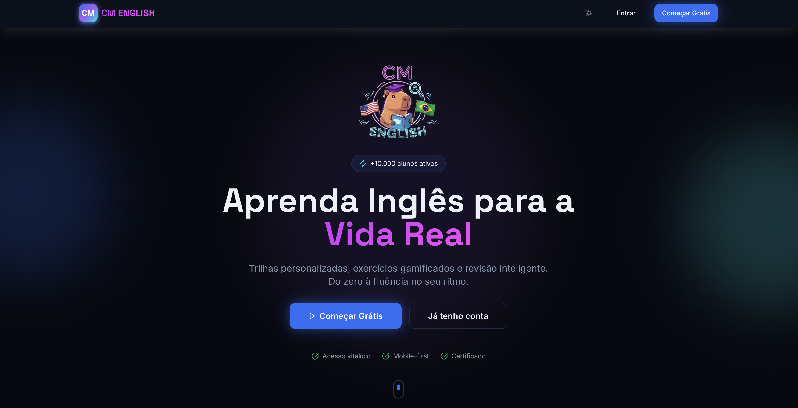
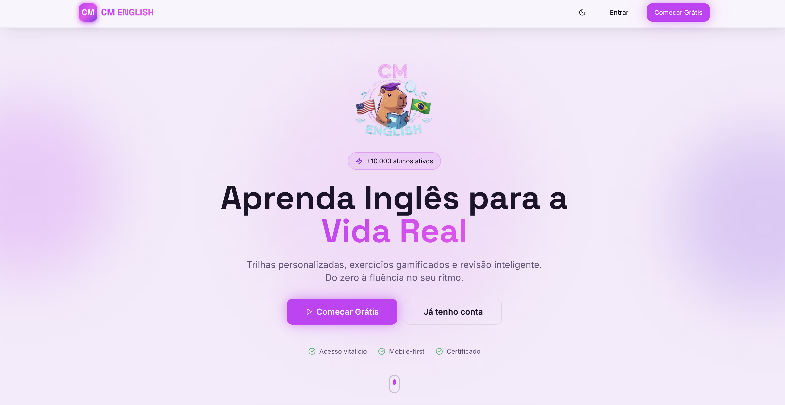
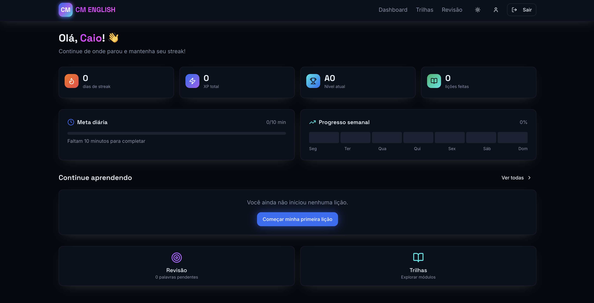
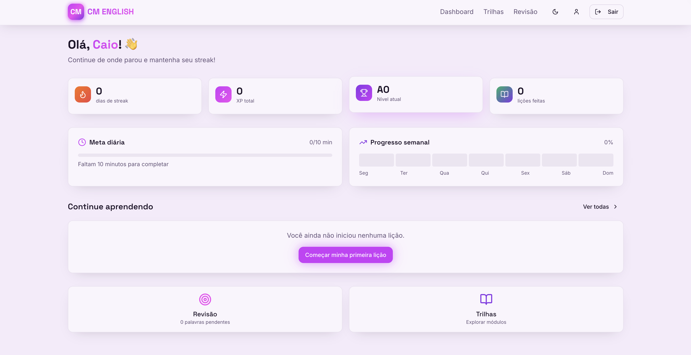
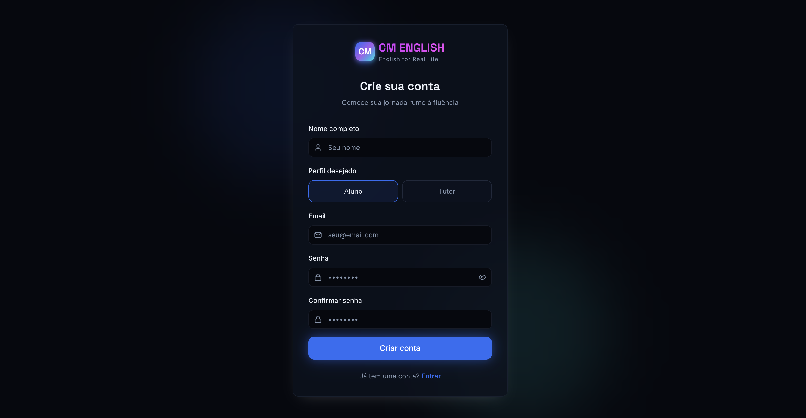
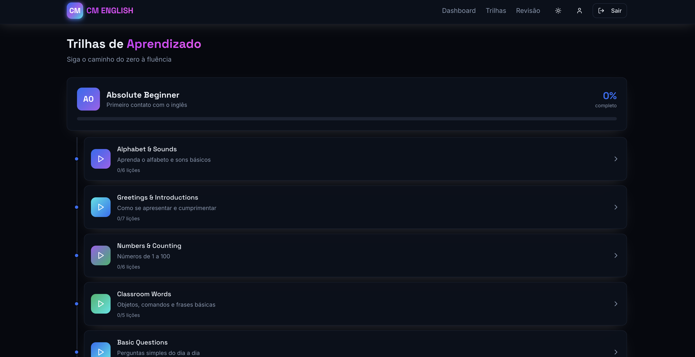

# CM English

CM English e uma nova ideia de plataforma para aprendizado de ingles focada em pratica guiada e acompanhamento simples do progresso. O projeto esta em fase de testes: hoje temos o front-end funcionando e a base para o back-end (Supabase) preparada. A proposta e evoluir para um fluxo completo com autenticacao, cadastro de aulas, exercicios e trilhas de estudo personalizadas.

## Preview

  
  
  
  
  
  

## Perfis de usuario e permissoes (visao geral)

- Admin Master: acesso total ao sistema, painel administrativo central, gestao de usuarios, papeis e permissoes, ativacao/desativacao de modulos e regras globais.
- Tutor: administracao limitada ao proprio universo (turmas/salas, alunos vinculados, mensagens, notificacoes, publicacao de conteudos proprios e uso de conteudos oficiais).
- Aluno: consumo livre do conteudo da plataforma ou participacao em turmas vinculadas a um tutor, sem acesso administrativo.

## Status

- Em teste (MVP)
- Front-end ativo
- Back-end em preparacao (estrutura Supabase)

## Estrutura do repositorio

- `front-end/` - aplicacao web (Vite + React)
- `back-end/` - infraestrutura e configuracao do banco (Supabase)

Cada pasta tem seu proprio README com detalhes de como rodar, variaveis e manutencao.

## Stack

Front-end:
- React + Vite
- TypeScript
- Tailwind CSS

Back-end:
- Supabase (Postgres + Auth)

## Arquitetura (diretriz)

- Autenticacao: Supabase Auth com perfis vinculados a papeis.
- Autorizacao: RLS no banco para reforcar a hierarquia (Admin Master, Tutor, Aluno).
- Dados: modelo preparado para multiplos contextos (aluno solo ou com tutor) e escalabilidade por turmas/organizacao.

## Como rodar

1) Front-end: veja `front-end/README.md`
2) Back-end (opcional por enquanto): veja `back-end/README.md`
